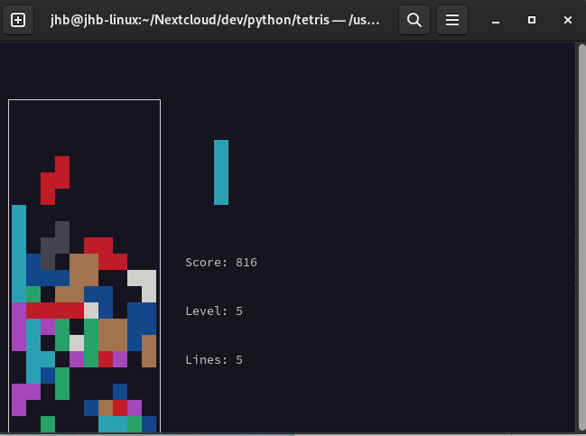
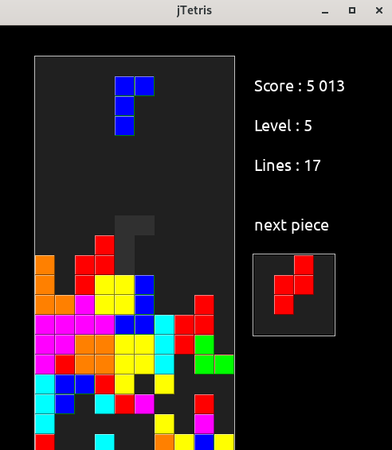
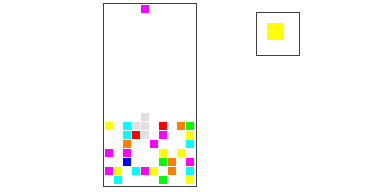
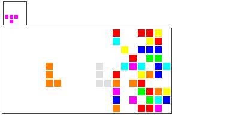

## *jTetris* - A simple and portable tetraminos game

### Présentation

`jTetris` ...

### Version

| Dépôt | https://github.com/GeeHB/dCleaner |
|-------|-------------------------------------|
| **Date** | 29 sept. 2023 |
| **Version stable** | **0\.9.1 - branche** `dev` |
| **Dépendances** | Python 3.xx |
| **Tested on** | *Linux (Fedora 37-38) - kernel 6.2.15* |
|| *MacOS Ventura* |
||*Windows 10* |

### Command line

| Short param. | Long param | Def. value | Meaning |
|-----------------|----------------|-------------------|------|
| *\-h* | *\--help* |  | Show help |
| *\-m* {mode} | *\--mode* {mode} | *auto* | Graphical mode. Can be one of {*auto*, *pygame*, *console*, *casioplot*, *casioplotv*}. |
|  |  |  | = *auto* (default value) : The system choose the best possible GUI. |
|  |  |  | = *pygame* : Use pyGame library |
|  |  |  | = *console* : Display the game in the calling console using nCurses library |
|  |  |  | = *casioplot* : Use casioplot library to display on casio computers| 
|  |  |  | = *casioplotv* : Use casioplot library to display on casio computers vertically| 
| *\-d {#lines}* | *\--dirty {#lines}* | 0 | Count of dirty lines present at startup |
| *\-l* {#level}| *\--level {#level}* |  1 | Starting game level|
| *\-s* | *\--shadow* |   | Display piece shadow|

### Samples

Displaying in a simple console using curses :

Display by the PYGame library :

*casioplot* mode on a PC :

*casioplotv* mode on a PC :

